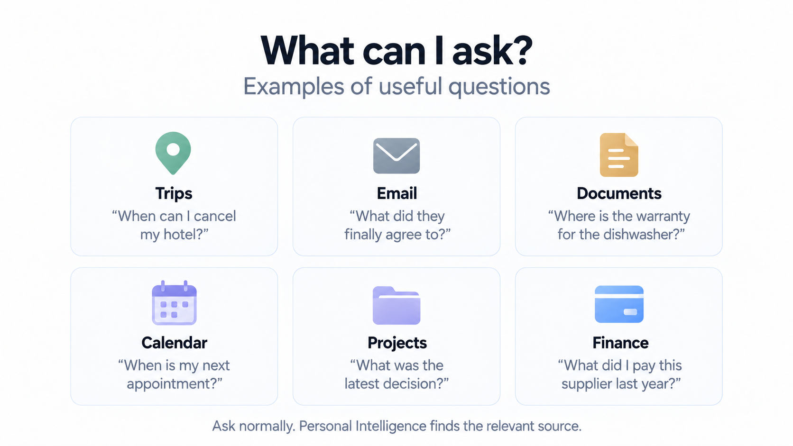
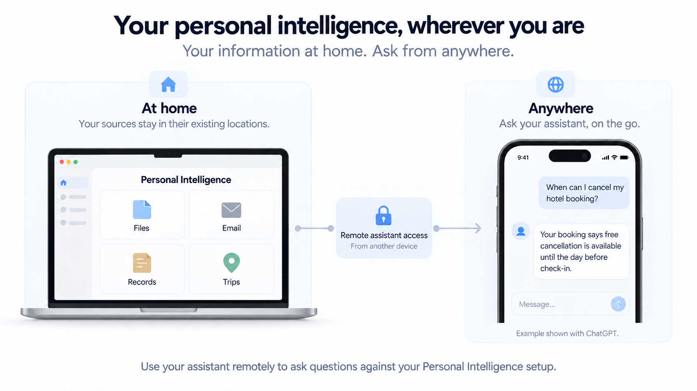

# Personal Intelligence

**Make your existing information usable.**

Personal Intelligence gives your assistant a structured way to find the right source, understand its authority, and answer from evidence — while your information and configuration remain yours.

**Klarhet Studio:** [https://klarhetstudio.com](https://klarhetstudio.com)


### Your information already exists.

Files. Email. Records. Trips. Projects. Accounts.

The problem isn't storing more information.

It's knowing **where to look, what to trust, and what actually answers the question.**

### Ask questions about your own life.

Ask in normal language about trips, email, documents, appointments, projects and explicitly scoped financial questions.

Personal Intelligence helps your assistant find the relevant source before answering.



### From question to evidence.

Personal Intelligence works through your assistant.

It helps identify the source that actually answers the question, compare authority, date and scope, and return an answer grounded in evidence.


### Personal intelligence, not another database.

Personal Intelligence doesn't copy everything into a new system.

It maps your existing sources and teaches the assistant how to use them.


### Your information stays yours.

Your files, integrations, source map and configuration remain private. The reusable skills and generic validation tooling can be shared without sharing your personal configuration or source collection.

### Your personal intelligence, wherever you are.

Personal Intelligence can also be used through a remote assistant workflow.

Remote use has been demonstrated with ChatGPT in the maintainer's setup. The exact behavior depends on the client, configured integrations and permissions; equivalent remote behavior in other assistants has not been verified by this release.



## How to install

### What you install

Personal Intelligence is a pair of skills and a small, offline validation toolkit. Your information stays in its existing locations; your source map and configuration stay outside the shared repository.

Version **0.1.0** is a reusable workflow release. It bundles no MCP server, transport, accounts, automatic indexing, OCR, background collection or write tools. The Python helper validates metadata and produces planned routes; it never reads the documents those routes point to or calls a provider. Ordinary answers use the assistant's existing authorized tools.

The workflow can be adapted to other assistants that support skills. This release documents Codex installation; installation and automatic skill selection in other clients remain unverified.

## The two skills

- **setup-personal-intelligence:** record requirements independently, confirm authority and scope, map existing sources, validate coverage and run useful acceptance questions.
- **personal-intelligence:** find relevant evidence within the question's scope, compare authority and dates, and answer with citations and clear limitations.

Use this for personal records, trips, household documentation, professional projects and explicitly scoped financial questions. It is useful when several files or applications could answer a question differently.

## Install and start

Clone this repository or download its ZIP, then follow the [installation and onboarding guide](plugins/personal-intelligence/skills/setup-personal-intelligence/references/installation.md). Then start a chat in your intended workspace:

> Use $setup-personal-intelligence to map my existing information. Keep configuration outside Git, preserve my working integrations, and identify the capabilities I want before proposing setup changes.

For macOS users wanting basic Calendar, Reminders, Contacts, Maps and Weather, **iMCP is the recommended starting integration**. Enable only the capabilities you choose. **cal-cli and RemCTL are optional advanced alternatives**; preserve them where they already work. Gmail and MoneyWiz remain separate optional integrations for email and financial questions. Personal Intelligence does not install any of them or connect accounts.

The [integration guide](plugins/personal-intelligence/skills/setup-personal-intelligence/references/integration-guide.md) covers installation, clients, permissions, supported operations, limitations and small scoped checks. File-based use works through existing authorized file-reading tools without another MCP. A configured route is not verified access; missing dependencies stay unavailable or unverified until checked.

Choose a private configuration directory, conventionally `$HOME/.config/personal-intelligence`, and tell the assistant where it is. Once configured:

> Use $personal-intelligence with my private profile to find the confirmation for my selected trip.

Normal invocation can also select the skill automatically. A missing privacy boundary still requires a focused question; a missing discoverable document/model/trip identifier usually requires narrow discovery first.

## Private configuration

The setup skill supplies three blank JSON templates and a schema reference. They describe sources and routes without copying their contents:

- `requirements.json`: independently captured user requirements, priorities and authority choices.
- `profile.json`: integrations, logical source IDs, routes and label workflows implementing them.
- `local-map.json`: exact source locations and existing instruction paths, outside Git.

An empty template is not a completed setup. The profile binds a digest of the independent requirements; changes need explicit reconciliation. The digest detects an accidental mismatch, not a forged approval or simultaneous malicious edit. Provider readiness metadata is testimony, not proof of current access; record its date and evidence in the private setup note.

Gmail priority labels are configurable and optional. No labels are prescribed for everyone. For Gmail questions, use its connected app/MCP exclusively; no browser, shell, local mail database or SMTP fallback. Other email providers can be recorded without labels; their dedicated provider route must be explicitly selected by the user. Version 0.1.0's generated label-query syntax is Gmail-specific.

Health requires one patient. Finance requires an explicit financial question and a bounded account/topic/date scope, including a deliberately stated aggregate-account scope when appropriate. Registration never grants background access. Identity, owner-private and other sensitive fields retain their separate task boundaries.

Your configuration and source collections are excluded from the shared package. When answering a question, the assistant may read relevant information through its authorized tools; how that information is processed depends on your chosen client, model provider and privacy settings.

## Companion integration: MoneyWiz

[MoneyWiz MCP Server](https://github.com/claessee/moneywiz-mcp-server) provides a separate, permanently read-only MCP interface to a local MoneyWiz database on macOS. It can supply ledger evidence for explicitly scoped financial questions; Personal Intelligence supplies the source-selection and evidence workflow.

The MoneyWiz server is optional and maintained separately. It is not bundled or installed by this package. Follow its own setup and reconciliation guidance, and keep financial configuration and results private.

## Verify without personal data

Requires Python 3.10 or later, standard library only. From the repository root:

```sh
python3 -m unittest discover -s tests -v
python3 scripts/check_release.py
python3 plugins/personal-intelligence/skills/setup-personal-intelligence/scripts/profile_tools.py validate --requirements examples/synthetic/requirements.json --profile examples/synthetic/profile.json --local-map examples/synthetic/local-map.json
```

The examples are entirely invented. Tests cover a fresh private setup, requirement omissions, separate patients, finance scope, labels with spaces, query injection, missing sources, source overrides and unavailable-provider metadata; archive tests check exact packaged content, checksums and collision refusal. They do not prove a live integration, successful real actions, model decision quality or filesystem confinement.

[RELEASE-READINESS.md](RELEASE-READINESS.md) separates automated checks, a manual synthetic evidence exercise and checks that remain for a recipient. A real setup should pass one useful question in each selected domain, judged against actual sources. Store those answers and timings privately.

## Keeping the rules useful

The personal-intelligence skill requires an already authorized action to be executed and its saved identity and fields checked before success is reported. It retains corrections and approvals, checks uncertain outcomes before retries, and reports pending or failed operations accurately. See the [rule and invented regression cases](plugins/personal-intelligence/skills/personal-intelligence/references/authorized-actions.md); it grants no new access or permissions.

The [rule-maintenance guide](plugins/personal-intelligence/skills/personal-intelligence/references/rule-maintenance.md) explains how a private correction becomes a generic improvement, how the release allowlist and manual review work, and how recipients update skills while retaining private configuration. There is no automatic anonymization or synchronization from personal instructions.

## Sharing

Share the plugin ZIP or this generic repository. The plugin ZIP contains the plugin and its two skills; the repository ZIP also contains tests, synthetic examples and the marketplace. Neither should contain a user's configuration, source bodies, path map, credentials or personal evaluation history.

Recipients connect their own existing tools and build their own source map.

MIT licensed. Contributions should use synthetic fixtures and preserve explicit scope, source authority, required-input completeness and unavailable-source honesty.
